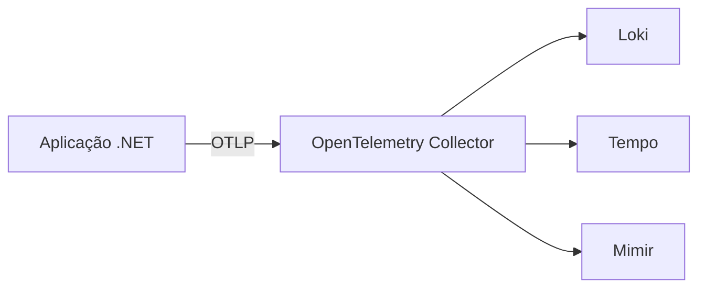

# Elven Docs Skill

Skill que produz docs técnicas Elven Works no padrão da casa, sem improvisar quando o tipo não existe no repo.

---

## Antes de começar — checagem rápida

Pare e responda:

1. **Onde o doc vai morar?** Se NÃO for em `elven-observability/docs/`, este skill não se aplica. Pare.
2. **É doc de produto Elven (instrumentação, instalação, SDK, PDtec)?** Se for ADR, runbook, post-mortem, RFC, release notes — **out of scope v1**. Responda ao usuário: "Este skill cobre apenas guias técnicos de produto (5 tipos). Esse pedido é fora de escopo. Sugiro abrir issue no repo `elven-docs-skill` solicitando o template novo, ou escrever sem skill por enquanto."
3. **É tradução pt→en?** Out of scope v1. Repo é pt-BR-only.

Se passou nas 3 verificações, siga abaixo.

---

## Workflow (11 passos)

### Passo 1 — Identificar o tipo do doc

Árvore de decisão. Pergunta única: **"O que esse doc ensina?"**

- **a)** Como instrumentar UMA linguagem específica (Java, Python, .NET, Node.js, Go, Ruby, …) → **`language-instrumentation-guide`**
- **b)** Como instrumentar via UMA plataforma/orquestrador (K8s Operator, AWS Lambda layers, Serverless plugin, ECS task helper, …) → **`platform-instrumentation-guide`**
- **c)** Como o cliente INSTALA componente Elven na infra dele (stack LGTM, Collector FE, Beyla standalone, …) → **`stack-installation-guide`**
- **d)** Como usar SDK frontend através de N frameworks (React, Next, Angular, Vue, …) → **`frontend-sdk-guide`**
- **e)** Spec curta (<300 linhas) específica de cliente PDtec (variáveis ECS, Dockerfile patch, copy-paste, …) → **`pdtec-spec`**
- **f)** Nenhuma das anteriores → **PARE**. Abra issue no repo `elven-docs-skill`. Não improvise template.

### Passo 2 — Copiar o template

```bash
TEMPLATE=<tipo>            # um dos 5 acima
SLUG=instrumentacao-go     # kebab-case, sem acento, igual ao filename sem .md
cp ~/.claude/skills/elven-docs-skill/templates/${TEMPLATE}.md \
   /Users/leonardozwirtes/Documents/Elven/elven-observability/docs/${SLUG}.md
```

Convenção de slug: minúsculas, hífen como separador, sem acento (`instrumentacao-` não `instrumentação-`).

### Passo 3 — Preencher frontmatter

Spec completa em `reference/frontmatter-spec.md`. 8 campos:

```yaml
---
title: Instrumentação Go com Elven Observability
slug: instrumentacao-go
type: language-instrumentation-guide
audience: [cliente-eng, agente-ia]
product_version: "OTel Go SDK 1.x"
last_reviewed: 2026-05-08
status: draft
owner: docs@elven.works
---
```

Validar imediatamente:

```bash
bash ~/.claude/skills/elven-docs-skill/scripts/lint.sh --frontmatter docs/instrumentacao-go.md
```

### Passo 4 — H1, abertura, Sumário

- **H1**: espelha `title` do frontmatter, sem versão de produto (versão vai no frontmatter, não no H1).
- **Abertura**: 1-2 linhas em pt-BR, imperativo direto. Bold em `traces`, `métricas`, `logs` na primeira menção.
- **Sumário**: H2 chamado **`Sumário`** (universal, exceto `frontend-sdk-guide` que usa `Índice` por convenção da família, e `pdtec-spec` que pode dispensar). Lista de links âncora pra cada H2 do doc. Regenerar links no fim, depois que estrutura estiver completa.

### Passo 5 — Preencher seções obrigatórias na ordem canônica

Cada template tem ossatura específica. Vocabulário de headings em `reference/canonical-section-headings.md`. Se uma seção não se aplica ao seu doc, **NÃO REMOVA** — escreva uma linha explicativa:

> Não se aplica a este guia. (justificativa em 1 linha)

Isso preserva o esqueleto pra o leitor identificar o tipo de cara.

### Passo 6 — Code fences

**SEMPRE** com tag de linguagem. Tabela completa em `reference/code-fence-language-map.md`. Casos comuns:

```bash
# shell scripts, comandos
```

```yaml
# helmfile, k8s manifests, otel-collector config
```

```dockerfile
# Dockerfile snippets
```

```typescript
# Faro, OTel JS code
```

```csharp
# .NET code
```

Lint rejeita ` ``` ` puro (sem tag).

### Passo 7 — Callouts e formatação

- **Callouts**: SEMPRE blockquote `>` com prefixo bold tipado. Vocabulário fechado em `reference/callout-vocabulary.md`:
  - `> **Atenção:**`
  - `> **Importante:**`
  - `> **Nota:**`
  - `> **Dica:**`
  - `> **Cuidado:**`
  - `> **Aviso:**`
- **Bold**: agressivo para variáveis (`**OTEL_EXPORTER_OTLP_ENDPOINT**`), arquivos (`**Dockerfile**`), termos críticos.
- **Italic**: raro. Só quando bold já está sobrecarregado.
- **Emojis**: **BANIDOS** no corpo do doc. Use texto: `**OK**` / `**Falha**` em vez de ✅/❌. Justificativa em `reference/style-guide.md` (WCAG 2.2 SC 1.1.1 + Técnica H86).
- **Versão de produto no H1**: PROIBIDO. Versão vai pro frontmatter `product_version`. H1 fica perene.

### Passo 8 — Diagramas

**Mermaid first**. GitHub renderiza nativamente desde fev/2022. Bloco:

````

````

ASCII só como fallback quando Mermaid não cabe (tabela visual de layers, layout extremamente customizado). Migração de docs ASCII existentes pra Mermaid é Fase 7+.

### Passo 9 — Lint binário

```bash
elven-docs-skill lint docs/instrumentacao-go.md
```

Esperado: `exit 0`. Resolver TODOS os warnings antes de prosseguir. Gate de PR é 10/10.

### Passo 10 — Self-review humano

Abrir `~/.claude/skills/elven-docs-skill/checklists/pre-publish.md` e bater item a item. Cobre o que o lint não pega: tom imperativo, completude do Quick Start, comandos rodam em macOS+Linux, ortografia.

### Passo 11 — Atualizar `last_reviewed` e abrir PR

```yaml
last_reviewed: 2026-05-08    # data de hoje
status: stable               # se já está pronto pra publicar; senão: draft
```

Commit semântico. PR menciona o `type`. Reviewer cola o output do lint na descrição.

---

## Triggers explícitos

### Use ESTE skill quando o usuário diz

- "criar guia de instrumentação \<X\>"
- "documentar SDK \<X\>"
- "atualizar doc de instalação da stack"
- "fazer um PDtec novo pra cliente Y"
- "revisar/normalizar/lintar elven-observability/docs/\<arquivo\>"
- "preparar PR de docs Elven"

### NÃO use ESTE skill quando

- O doc é fora de `elven-observability/docs/` (ex: README de outro repo).
- O usuário pediu ADR, runbook, post-mortem, RFC, release notes, changelog.
- O usuário quer traduzir doc pt→en.
- O usuário quer doc gerada (OpenAPI/Swagger UI, TypeDoc, Sphinx autodoc).

Se ambíguo, pergunte ao usuário em vez de improvisar.

---

## Personas alvo (declaradas no frontmatter `audience`)

- **`cliente-eng`** — Engenheiro/SRE no cliente fazendo a integração.
- **`cliente-sre`** — SRE do cliente fazendo deploy/operação de componente hospedado.
- **`agente-ia`** — Sentinel, Claude, ou outro agente AI consumindo doc como contexto estruturado.
- **`eng-elven`** — Engenheiro Elven escrevendo/revisando doc.
- **`onboarding-eng-elven`** — Pessoa nova no time Elven (primeiros 30 dias).

Matriz template × audience: `checklists/persona-coverage.md`.

---

## Recursos do skill

- **Templates**: `templates/{language,platform,stack-installation,frontend-sdk,pdtec}.md`
- **Style guide com fontes 2026**: `reference/style-guide.md`
- **Frontmatter spec**: `reference/frontmatter-spec.md`
- **Vocabulário de seções**: `reference/canonical-section-headings.md`
- **Vocabulário de callouts**: `reference/callout-vocabulary.md`
- **Mapa de tags de fence**: `reference/code-fence-language-map.md`
- **Glossário Elven**: `reference/glossary.md`
- **Checklists**: `checklists/pre-publish.md`, `checklists/persona-coverage.md`, `checklists/accessibility.md`
- **Lint binário**: `scripts/lint.sh`
- **Backfill retroativo**: `scripts/backfill-frontmatter.sh` (só Fase 7)

---

## O que esse skill DELIBERADAMENTE não faz

- **Não inventa templates pra tipos ausentes.** Se você precisa de ADR/runbook/post-mortem, pare e abra issue.
- **Não migra docs legados automaticamente.** Migração retroativa é PR humano-supervisionado, não execução de skill.
- **Não traduz pt→en.** Repo é pt-BR-only nesta versão.
- **Não documenta API gerada.** OpenAPI/Swagger UI são outras ferramentas.
- **Não lintha prosa.** Lint v1 é estrutural; prosa é review humano por enquanto. Adicionar Vale/markdownlint é roadmap pós-v0.1.0.
