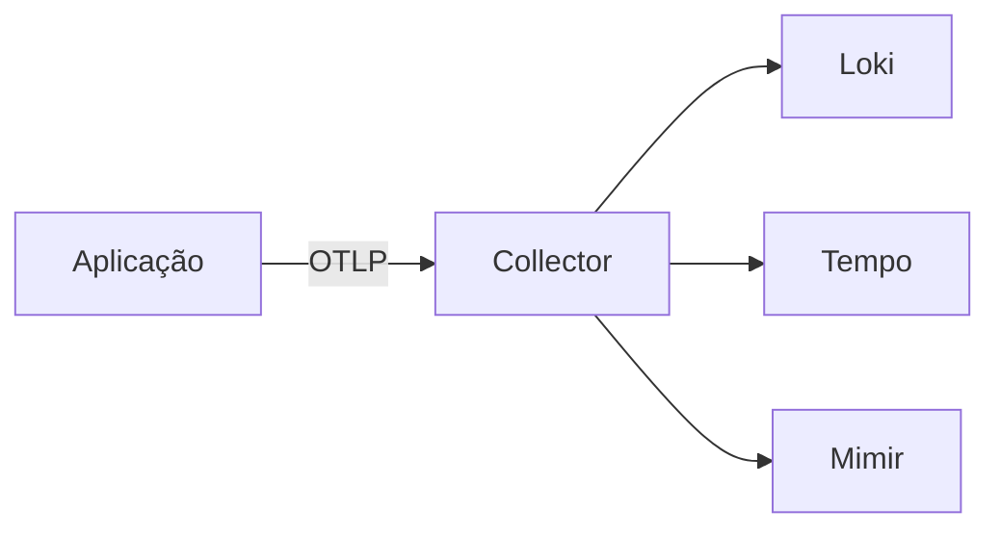

# Code Fence Language Map

Tag canônica de code fence por linguagem/contexto. Lint rejeita ` ``` ` puro (sem tag).

---

## Tabela autoritativa

| Contexto | Tag canônica | Aliases aceitos | NÃO usar |
|----------|--------------|-----------------|----------|
| Comandos shell, scripts shell | `bash` | `sh` (apenas em scripts POSIX explícitos) | `console`, `terminal`, `shell` |
| YAML (Helm, K8s, Helmfile, Otel Collector config) | `yaml` | — | `yml` |
| Dockerfile | `dockerfile` | — | `docker` |
| JSON (Task Definition ECS, package.json, response payloads) | `json` | — | `js-object`, `javascript` |
| TypeScript (Faro, OTel JS) | `typescript` | `ts` | `javascript` quando o código tem types |
| TypeScript JSX (React/Next com types) | `tsx` | — | `typescript` quando há JSX |
| JavaScript (vanilla browser, Node.js) | `javascript` | `js` | `typescript` quando não há types |
| JSX (React sem types) | `jsx` | — | `javascript` quando há JSX |
| Python | `python` | `py` | `python3` |
| Java | `java` | — | `kotlin` para Java code |
| C# / .NET | `csharp` | `cs` | `dotnet` |
| Go | `go` | — | `golang` |
| Ruby | `ruby` | `rb` | — |
| PHP | `php` | — | — |
| Rust | `rust` | `rs` | — |
| HTML | `html` | — | `xml` para HTML |
| XML (ServiceManifest, etc.) | `xml` | — | `html` para XML |
| PowerShell | `powershell` | `ps1` | `pwsh` |
| Diff/patch | `diff` | — | — |
| Mermaid (diagramas) | `mermaid` | — | `text` para mermaid |
| ASCII art / output literal | `text` | — | tag vazia |

---

## Casos comuns no repo Elven

### Comandos para o cliente rodar

```bash
helm install otel-collector open-telemetry/opentelemetry-collector \
  --set mode=daemonset
```

### YAML de Helm/K8s

```yaml
mode: daemonset
config:
  exporters:
    otlphttp:
      endpoint: ${ELVEN_OTLP_ENDPOINT}
```

### JSON Task Definition (PDtec)

```json
{
  "environment": [
    { "name": "OTEL_EXPORTER_OTLP_ENDPOINT", "value": "https://otel-ext.pd.tec.br" }
  ]
}
```

### Dockerfile

```dockerfile
FROM python:3.12-slim
RUN pip install elven-unified-observability-py
ENTRYPOINT ["elven-unified-observability", "python", "app.py"]
```

### Faro (TypeScript em React)

```tsx
import { initializeFaro } from "@grafana/faro-web-sdk";

initializeFaro({
  url: "https://collector-fe.cliente.com.br/collect",
  app: { name: "checkout-web", version: "1.0.0" }
});
```

### .NET

```csharp
builder.Services.AddOpenTelemetry()
    .WithTracing(tracing => tracing
        .AddAspNetCoreInstrumentation()
        .AddOtlpExporter());
```

### Diagrama Mermaid

````

````

### ASCII fallback

```text
┌──────────┐  OTLP  ┌──────────┐
│  App     │ ─────> │ Collector│
└──────────┘        └─────┬────┘
                          │
              ┌───────────┼───────────┐
              ▼           ▼           ▼
            Loki        Tempo       Mimir
```

---

## Por que tag explícita

1. **Rendering.** Highlighters (Prism, Highlight.js, GitHub) precisam da tag pra colorir. Sem tag = bloco monocromático.
2. **Lint.** Linters como `markdownlint` (regra MD040) exigem tag.
3. **RAG.** Chunkers detectam linguagem do snippet via tag e podem indexar separadamente código vs prosa.
4. **Acessibilidade.** Screen readers anunciam linguagem do bloco quando declarada.

---

## Convenção pra diff inline em PR de doc

```diff
- url: https://collector.elvenobservability.com
+ url: https://otel-collector.cliente.com.br
```

Tag `diff` em mudança proposta. Não confundir com `bash` quando mostrando comando que o cliente roda.
