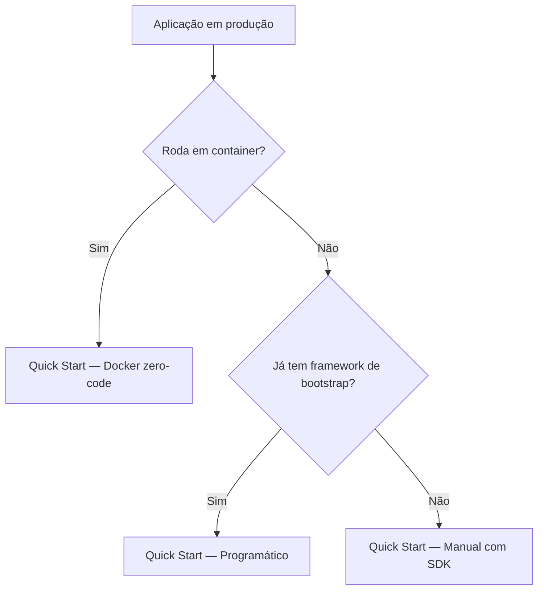

# Instrumentação <LINGUAGEM> com Elven Observability

Guia completo para instrumentar aplicações <LINGUAGEM> com **traces**, **métricas** e **logs**, enviando dados para a stack da Elven Observability via OpenTelemetry.

> **Nota:** Este guia cobre <variantes principais — ex: zero-code Docker, programático, Lambda>. Use o sumário para pular direto pra variante que se aplica ao seu caso.

---

## Sumário

- [Visão geral](#visão-geral)
- [Pré-requisitos](#pré-requisitos)
- [Caminho recomendado](#caminho-recomendado)
- [Quick Start — <variante 1>](#quick-start--variante-1)
- [Quick Start — <variante 2>](#quick-start--variante-2)
- [Pacotes disponíveis](#pacotes-disponíveis)
- [Configuração por variáveis de ambiente](#configuração-por-variáveis-de-ambiente)
- [Logs e correlação com Loki](#logs-e-correlação-com-loki)
- [Traces manuais, erros e atributos semânticos](#traces-manuais-erros-e-atributos-semânticos)
- [Métricas manuais](#métricas-manuais)
- [Instrumentações automáticas](#instrumentações-automáticas)
- [Privacidade e dados sensíveis](#privacidade-e-dados-sensíveis)
- [Validação ponta a ponta](#validação-ponta-a-ponta)
- [Troubleshooting](#troubleshooting)
- [FAQ](#faq)

---

## Visão geral

Resuma em 3-5 parágrafos:

1. O que esse SDK/agent entrega (traces, métricas, logs).
2. Quais frameworks/runtimes são suportados.
3. Que abordagens (zero-code, programático, manual) estão disponíveis.
4. Em qual cenário esse guia é o caminho recomendado.

> **Importante:** Em modo Elven, **logs, métricas e traces ficam sempre ligados**. Configurações que tentam desligar um sinal (ex: `OTEL_LOGS_EXPORTER=none`) são tratadas como erro de configuração.

---

## Pré-requisitos

### Baseline técnico

- Versões mínimas suportadas (runtime, framework).
- Acesso ao tenant Elven (`tenant_id` e token entregues pelo time da Elven).
- Conectividade outbound HTTPS para o endpoint OTLP do cliente (geralmente `otel-collector.<infra-cliente>:4318`).

### Protocolos suportados

| Protocolo | Suporte | Observações |
|-----------|---------|-------------|
| OTLP/HTTP | Recomendado | Default deste guia |
| OTLP/gRPC | Suportado | Use quando latência interna importa |
| Prometheus remote_write | — | Use o Otel Collector como ponte |

### Targets / runtimes

- Frameworks suportados (listar com versões mínimas).
- Limitações conhecidas (ex: lib X com versão Y < tem bug Z).

---

## Caminho recomendado

> Árvore de decisão pra ajudar o cliente a escolher a variante.



Se em dúvida, comece pelo **Docker zero-code** — menor toque no código.

---

## Quick Start — <variante 1>

> Substitua `<variante 1>` por um nome curto: "Docker zero-code", "Programático", etc. Use **em-dash** `—` (U+2014) como separador.

Passos numerados, end-to-end. Meta: cliente consegue ver dados no Grafana em <10 minutos.

### 1. Adicionar dependência

```bash
# instalação
```

### 2. Configurar variáveis de ambiente

```bash
export OTEL_EXPORTER_OTLP_ENDPOINT=http://otel-collector.minha-infra.com:4318
export OTEL_RESOURCE_ATTRIBUTES="service.name=meu-servico,deployment.environment=production"
```

### 3. Iniciar a aplicação

```bash
# comando que dispara a aplicação com instrumentação
```

### 4. Validação rápida

Faça uma requisição:

```bash
curl https://app.meusite.com.br/health
```

Em 30-60 segundos, no Grafana Tempo, busque pelo `service.name`. Trace deve aparecer.

---

## Quick Start — <variante 2>

(Se aplicável. Mesma estrutura: passos 1-4.)

---

## Pacotes disponíveis

Tabela com pacotes/dependências oficiais e suas funções:

| Pacote | Versão recomendada | Função |
|--------|--------------------|--------|
| `<pacote-1>` | `>= 1.0.0` | Auto-instrumentação base |
| `<pacote-2>` | `>= 1.0.0` | Exporter OTLP |
| `<pacote-3>` | `>= 1.0.0` | Instrumentação de framework X |

---

## Configuração por variáveis de ambiente

### Obrigatórias

| Variável | Descrição | Exemplo |
|----------|-----------|---------|
| `OTEL_EXPORTER_OTLP_ENDPOINT` | URL base do OTel Collector | `http://otel-collector.minha-infra.com:4318` |
| `OTEL_RESOURCE_ATTRIBUTES` | Atributos do resource (mín: `service.name`, `deployment.environment`) | `service.name=checkout,deployment.environment=production` |

### Opcionais relevantes

| Variável | Default | Descrição |
|----------|---------|-----------|
| `OTEL_TRACES_SAMPLER` | `parentbased_always_on` | Estratégia de sampling |
| `OTEL_LOG_LEVEL` | `info` | Nível de log do agent |

---

## Logs e correlação com Loki

Como configurar para que logs apareçam em `loki.elvenobservability.com` correlacionados com traces.

```bash
export OTEL_LOGS_EXPORTER=otlp
export OTEL_PYTHON_LOG_CORRELATION=true   # (exemplo Python; ajustar por linguagem)
```

Padrão de query Loki para correlação:

```logql
{service_name="meu-servico"} | json | trace_id="<trace-id>"
```

---

## Traces manuais, erros e atributos semânticos

Quando a auto-instrumentação não cobre, use a API SDK pra criar spans, gravar erros, e adicionar atributos semânticos.

```<linguagem>
// pseudocódigo: criar span manual, gravar exception, adicionar atributo
```

Convenções semânticas obrigatórias:

- `http.method`, `http.status_code` — HTTP
- `db.system`, `db.statement` — banco de dados
- `messaging.system`, `messaging.destination` — fila/streaming

Lista completa: [OpenTelemetry semantic conventions](https://opentelemetry.io/docs/specs/semconv/).

---

## Métricas manuais

Quando criar instrumento manual:

```<linguagem>
// pseudocódigo: counter, histogram, gauge
```

Convenção de nomes: `<componente>.<recurso>.<unidade>`. Ex: `checkout.orders.total`, `payments.latency.ms`.

---

## Instrumentações automáticas

Tabela das libs que o agent/SDK auto-instrumenta sem código adicional:

| Lib | Versões suportadas | Sinais coletados |
|-----|---------------------|------------------|
| `<framework-web>` | `>= X.Y` | Traces de request HTTP, atributos semânticos |
| `<orm>` | `>= X.Y` | Traces de query SQL, span attribute `db.statement` |
| `<http-client>` | `>= X.Y` | Traces de chamada outbound |

> **Atenção:** Se a aplicação já usa um agent legado (ex: New Relic, Datadog), **não habilite a auto-instrumentação Elven em paralelo sem validar antes**. Dupla instrumentação costuma gerar conflito, overhead, e comportamento imprevisível.

---

## Privacidade e dados sensíveis

> **Cuidado:** Nunca envie CPF, senha, token, ou qualquer dado pessoal nos atributos de span ou em log message. Se a aplicação loga payload, sanitize antes.

Checklist:

- [ ] PII removida ou hasheada antes de chegar ao SDK.
- [ ] Headers Authorization filtrados (`OTEL_INSTRUMENTATION_HTTP_CAPTURE_HEADERS_*` configurado pra excluir).
- [ ] Logs de body de request sanitizados.

---

## Validação ponta a ponta

Sequência que confirma que dados estão chegando na Elven:

### 1. Smoke local

Após inicializar a aplicação:

```bash
# logs do agent devem mostrar export bem-sucedido
docker logs <container> 2>&1 | grep -i "otlp"
```

Esperado: linhas tipo `Exported X spans` ou `Sent batch of N items`.

### 2. Trace no Grafana Tempo

1. Acesse `https://monitoring.elven.works`.
2. Datasource Tempo → Explore.
3. Query: `{ service.name = "<seu-servico>" }`.
4. Esperado: trace aparece em até 60 segundos após uma request.

### 3. Logs no Grafana Loki

1. Datasource Loki → Explore.
2. Query: `{service_name="<seu-servico>"}`.
3. Esperado: logs estruturados com `trace_id` correlacionado.

### 4. Métricas no Grafana (Mimir)

1. Datasource Mimir → Explore.
2. Query: `up{service_name="<seu-servico>"}` ou métrica específica do framework.
3. Esperado: série temporal com pontos recentes.

---

## Troubleshooting

Padrão sintoma → causa → fix.

### Métricas não aparecem no Mimir

**Sintoma.** Painel "OTel Service Health" mostra "no data" para o serviço.

**Causa provável.** `OTEL_EXPORTER_OTLP_ENDPOINT` aponta pra DNS errado ou Collector não está rodando.

**Fix.**

1. Verifique resolução DNS: `nslookup otel-collector.minha-infra.com`.
2. Cheque conectividade: `curl -v http://otel-collector.minha-infra.com:4318/v1/metrics`.
3. Confirme que o Collector está com pipeline de métricas habilitado.

### Erro de TLS / certificate

**Sintoma.** Logs do agent mostram `x509: certificate signed by unknown authority`.

**Causa provável.** Collector usa CA interna não confiada pelo runtime.

**Fix.** Adicione a CA ao truststore do runtime, ou use `OTEL_EXPORTER_OTLP_INSECURE=true` apenas em dev.

### Logs sem `trace_id`

**Sintoma.** Logs no Loki não têm `trace_id` para correlação.

**Causa provável.** Log correlation não habilitada na lib de logging.

**Fix.** Habilite a opção específica da linguagem (ver [Logs e correlação](#logs-e-correlação-com-loki)).

---

## FAQ

### Posso usar com agent legado (New Relic, Datadog) ao mesmo tempo?

Não recomendado. Ver [Atenção em Instrumentações automáticas](#instrumentações-automáticas).

### Quanto tempo o Loki retém os logs?

30 dias por padrão no plano Elven. Retenção customizada disponível sob acordo.

### Como amostrar (sample) só uma fração das requests?

Configure `OTEL_TRACES_SAMPLER=parentbased_traceidratio` e `OTEL_TRACES_SAMPLER_ARG=0.1` para 10%. Sampling por sessão (Faro) é independente.

### O agent funciona offline (sem conexão com a Elven)?

O agent buffereia em memória. Se o buffer enche e o Collector não responde, dados são descartados. Para tolerância a falha mais robusta, use Otel Collector com persistent queue na infra do cliente.
