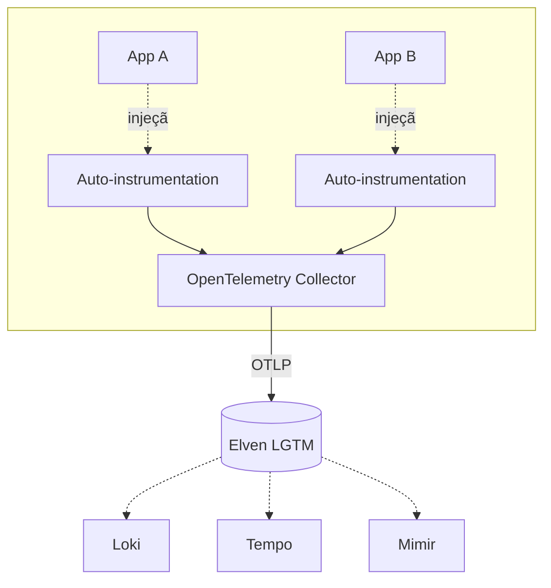

# Instrumentação <PLATAFORMA> com Elven Observability

Guia completo para instrumentar aplicações que rodam em **<PLATAFORMA>** (ex: Kubernetes via OpenTelemetry Operator, AWS Lambda via layer manual, AWS Lambda via Serverless plugin), enviando **traces**, **métricas** e **logs** para a Elven Observability.

> **Nota:** Este guia foca no caminho via plataforma/orquestrador. Para instrumentação por linguagem fora deste contexto, ver os guias `instrumentacao-{java,python,nodejs,dotnet}.md`.

---

## Sumário

- [Visão geral](#visão-geral)
- [Quando usar este guia](#quando-usar-este-guia)
- [Arquitetura](#arquitetura)
- [Pré-requisitos](#pré-requisitos)
- [Quick Start](#quick-start)
- [Instalação passo a passo](#instalação-passo-a-passo)
- [Configuração](#configuração)
- [Controle por <unidade>](#controle-por-unidade)
- [Validação ponta a ponta](#validação-ponta-a-ponta)
- [Troubleshooting](#troubleshooting)
- [FAQ](#faq)
- [Veja também](#veja-também)

---

## Visão geral

Resumo do que a plataforma entrega:

- Mecanismo de injeção (sidecar, agent runtime, layer, init container, plugin de framework).
- Sinais cobertos automaticamente vs. sinais que ainda exigem instrumentação manual.
- Cenários onde esse caminho é o recomendado vs. cenários onde outro guia se aplica.

> **Importante:** Em modo Elven, **logs, métricas e traces ficam sempre ligados**. Configurações que tentam desligar um sinal são tratadas como erro de configuração.

---

## Quando usar este guia

Use este guia se:

- Sua aplicação roda em <PLATAFORMA>.
- Você quer onboarding com baixo toque de código.
- Você precisa de padrão único de observabilidade aplicado a múltiplos serviços ao mesmo tempo.

NÃO use este guia se:

- Você tem 1 serviço isolado fora da plataforma → ver `instrumentacao-<linguagem>.md`.
- Você precisa controle fino de sampling/atributos não suportados pela injeção → ver instrumentação programática.
- Sua plataforma é diferente (ex: ECS sem OTel Operator, Cloud Run sem sidecar) → consulte time da Elven antes de improvisar.

---

## Arquitetura



Componentes:

- **<MECANISMO DE INJEÇÃO>** — descreva: como aplicação fica instrumentada sem alteração de código.
- **OpenTelemetry Collector** — agrega, sampleia, e encaminha. Mora no cliente (não na Elven).
- **Backends Elven** — Loki (logs), Tempo (traces), Mimir (métricas).

---

## Pré-requisitos

### Baseline da plataforma

- Versão mínima de <PLATAFORMA> (ex: Kubernetes 1.27+, AWS Lambda runtime nodejs18+).
- Permissões/roles necessários (ex: cluster-admin para instalar Operator, IAM role X para Lambda).
- Pré-instalação de Helm/CLI/SDK específicos.

### Acesso à Elven

- `tenant_id` e token OTLP da Elven.
- Conectividade outbound HTTPS para Loki/Tempo/Mimir Elven.
- Domínio público com DNS apontando (se aplicável a este componente).

### Compatibilidade com cargas de trabalho

| Tipo de workload | Suporte | Observação |
|------------------|---------|------------|
| Container Java | ✅ | Java agent injetado via `inject-java` |
| Container .NET | ✅ | Profiler injetado via `inject-dotnet` |
| Lambda Python | ✅ | Layer Elven |
| Lambda Go | ⚠️ | Manual; Go não tem auto-instrumentation runtime |

---

## Quick Start

Caminho mais curto: cliente vê primeiro trace em <15 minutos.

### 1. Instalar componente da plataforma

```bash
# comando único de instalação (helm, cli, ou similar)
```

### 2. Aplicar configuração mínima

```yaml
# ou bash, ou template específico da plataforma
```

### 3. Anotar/marcar workloads-alvo

```yaml
# anotação por deployment / namespace / função
```

### 4. Verificar primeiros sinais

```bash
# query Tempo / curl / log do collector
```

---

## Instalação passo a passo

Versão expandida do Quick Start, com explicação de cada etapa, opções de customização, e callouts para variantes.

### Passo 1 — <descrição>

```bash
# comando
```

> **Nota:** explicação contextual.

### Passo 2 — <descrição>

(seguir mesmo padrão)

### Passo 3 — <descrição>

(...)

---

## Configuração

### Variáveis de ambiente injetadas

| Variável | Default | Descrição |
|----------|---------|-----------|
| `OTEL_EXPORTER_OTLP_ENDPOINT` | (definido por instalação) | Endpoint do Collector |
| `OTEL_RESOURCE_ATTRIBUTES` | `service.name=<auto>,deployment.environment=<auto>` | Atributos automáticos |

### Opções da plataforma

Liste opções específicas da plataforma (ex: configmap do Operator, plugin opts, manifest do componente).

```yaml
# exemplo de configuração
```

---

## Controle por <unidade>

Substitua `<unidade>` pela unidade da plataforma:

- Kubernetes: **deployment** ou **namespace**.
- Lambda: **função** ou **stack** Serverless.
- ECS: **task definition** ou **service**.

Como habilitar/desabilitar instrumentação granularmente:

```yaml
# anotação opt-in
```

```yaml
# anotação opt-out (quando padrão é opt-in via namespace)
```

> **Dica:** Anotação por deployment é a forma mais segura de fazer rollout gradual, canário, e troubleshooting.

---

## Validação ponta a ponta

### 1. Verificar injeção

```bash
# como confirmar que o componente está injetando (kubectl describe pod, lambda config, etc.)
```

### 2. Trace no Grafana Tempo

```
{ service.name = "<seu-servico>" }
```

### 3. Logs no Grafana Loki

```logql
{service_name="<seu-servico>"}
```

### 4. Métricas no Grafana (Mimir)

```promql
up{service_name="<seu-servico>"}
```

---

## Troubleshooting

### Pod/função não inicia após habilitar instrumentação

**Sintoma.** Pod fica em `CrashLoopBackOff` ou Lambda timeout cold start.

**Causa provável.** Init container/layer falha por imagem indisponível ou permissão IAM.

**Fix.**

1. `kubectl describe pod <nome>` ou CloudWatch logs do init.
2. Confirme que image registry está acessível.
3. Confirme IAM role / RBAC.

### Aplicação registra dupla instrumentação

**Sintoma.** Spans duplicados aparecem no Tempo.

**Causa provável.** Agent legado + auto-instrumentação Elven simultâneos.

**Fix.** Desabilite o agent legado antes de habilitar Elven. Ver [Aviso em Configuração](#configuração).

---

## FAQ

### Posso instrumentar só parte do cluster/conta AWS?

Sim. Anotação por unidade (deployment/função) é o padrão pra rollout granular.

### O Operator/plugin auto-atualiza?

Não. Atualizações são via Helm release / `npm update` do plugin. Ver [Atualização](#atualização) (se aplicável).

### Funciona com workload privado (sem internet outbound)?

Sim, desde que o OTel Collector tenha conectividade outbound. Workloads enxergam só o Collector interno.

---

## Veja também

- `instrumentacao-<linguagem>.md` — instrumentação programática quando você precisa de controle fino.
- `instalacao-stack-observabilidade-kubernetes.md` — instalação da stack completa Elven se você ainda não tem.
- `<doc-relacionado>.md` — outro guia relacionado.
