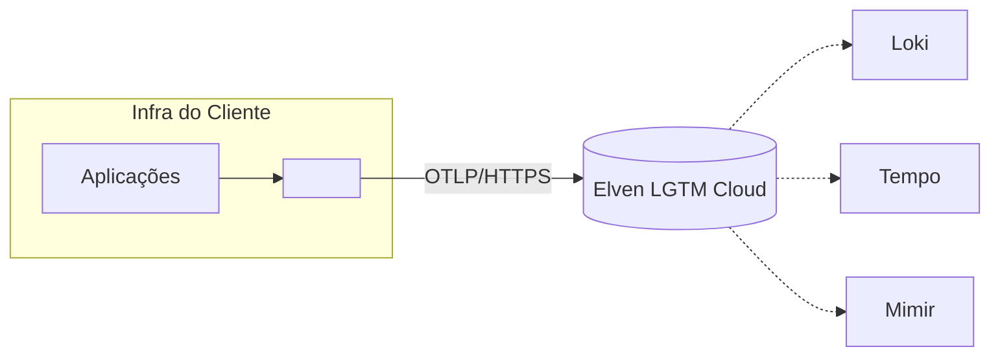

# Instalação de <COMPONENTE> Elven em <ALVO>

Guia completo para o cliente **instalar e operar** o <COMPONENTE> da Elven Observability em sua própria infraestrutura (<ALVO>).

> **Importante:** Este componente é **implantado na infraestrutura do cliente**, não na Elven. A Elven fornece credenciais e participa do deploy em conjunto com o time de plataforma do cliente.

---

## Sumário

- [Visão geral](#visão-geral)
- [Arquitetura](#arquitetura)
- [O que <componente> instala/coleta](#o-que-componente-instalacoleta)
- [Pré-requisitos](#pré-requisitos)
- [Antes de começar](#antes-de-começar)
- [Quick Start](#quick-start)
- [Instalação passo a passo](#instalação-passo-a-passo)
- [O que pode ser customizado](#o-que-pode-ser-customizado)
- [Como funciona](#como-funciona)
- [Validação após a instalação](#validação-após-a-instalação)
- [Atualização](#atualização)
- [Remoção](#remoção)
- [Troubleshooting](#troubleshooting)
- [Checklist final](#checklist-final)
- [Veja também](#veja-também)

---

## Visão geral

3-5 parágrafos:

1. O que esse componente faz dentro da arquitetura Elven.
2. Por que ele mora no cliente (não na Elven).
3. Que carga de operação fica do lado do cliente vs. da Elven.
4. Em qual cenário esse componente é necessário (não esconder pré-requisitos).

---

## Arquitetura



Componentes envolvidos:

- **<COMPONENTE>** — descreva.
- **Aplicações cliente** — quem emite dados.
- **Elven LGTM** — backend SaaS.

Fluxo de dados:

1. Aplicação emite OTLP/HTTPS.
2. <COMPONENTE> recebe e encaminha (com possíveis transformações).
3. Elven Loki/Tempo/Mimir armazena.

---

## O que <componente> instala/coleta

Liste explicitamente o que vai virar realidade no cluster/VM/conta após `helm install` ou equivalente:

- **Workloads.** ex: 3 deployments (componente-api, componente-worker, componente-cache).
- **Recursos.** ex: 1 ConfigMap, 2 Secrets, 1 Ingress.
- **Métricas exportadas.** ex: `componente_requests_total`, `componente_buffer_size`.
- **Logs gerados.** ex: log estruturado em stdout, JSON.

---

## Pré-requisitos

### Plataforma alvo

- Versão mínima de <ALVO> (ex: Kubernetes 1.27+, Ubuntu 22.04+).
- Recursos mínimos: CPU, memória, disco, rede.
- Permissões: cluster-admin / sudo / IAM específico.

### Ferramentas no operador

- Helm `>= 3.10`, `kubectl`, `jq`.
- Acesso ao registry de imagens da Elven (`ghcr.io/elven-works/...`).

### Acesso à Elven

- `tenant_id` e token (entregues pelo time da Elven em onboarding).
- Domínio público apontando pra IP/load balancer (se aplicável).

> **Pré-requisito:** O DNS do domínio `<COMPONENTE_DOMAIN>` deve apontar para o IP público **antes** da instalação. (Justifique: ex: Caddy/cert-manager precisa resolver o domínio para gerar certificado Let's Encrypt.)

---

## Antes de começar

### Tenant e token

A Elven fornece em onboarding:

```env
ELVEN_TENANT=<tenant-id>
ELVEN_TOKEN=<token>
```

Guarde em secret manager (Vault, AWS Secrets, K8s Secret). **Não commit em git.**

### DNS e TLS

(Se aplicável.) Configure DNS A/CNAME apontando pra ponto de entrada do componente.

### Limites e quotas

- Quota de tenant na Elven: <X GB/dia logs, Y traces/segundo>.
- Quota de envio do componente: configurável; default em "[Configuração](#o-que-pode-ser-customizado)".

---

## Quick Start

Resultado: componente rodando e enviando primeiros sinais em <30 minutos.

### 1. Adicionar repositório Helm

```bash
helm repo add elven https://elven-observability.github.io/charts
helm repo update
```

### 2. Criar namespace e secret com credenciais

```bash
kubectl create namespace elven-observability
kubectl create secret generic elven-credentials \
  --namespace elven-observability \
  --from-literal=tenant=$ELVEN_TENANT \
  --from-literal=token=$ELVEN_TOKEN
```

### 3. Instalar com values mínimos

```bash
helm install <componente> elven/<componente> \
  --namespace elven-observability \
  --set ingress.host=<componente>.<dominio-cliente>.com.br
```

### 4. Verificar

```bash
kubectl get pods -n elven-observability
curl -k https://<componente>.<dominio-cliente>.com.br/healthz
```

---

## Instalação passo a passo

Versão detalhada do Quick Start. Cada passo com explicação do "por quê".

### Passo 1 — Adicionar repo Helm e atualizar

```bash
helm repo add elven https://elven-observability.github.io/charts
helm repo update
```

(...)

### Passo 2 — Criar namespace dedicado

(...)

### Passo 3 — Configurar secrets

(...)

### Passo 4 — Customizar values.yaml

(...)

### Passo 5 — Instalar

(...)

### Passo 6 — Configurar Ingress / TLS

(...)

---

## O que pode ser customizado

Tabela das principais opções de `values.yaml` (ou equivalente):

| Chave | Default | Descrição |
|-------|---------|-----------|
| `replicaCount` | `2` | Réplicas do deployment principal |
| `resources.requests.memory` | `512Mi` | Memória mínima |
| `ingress.host` | — | Domínio externo (obrigatório) |
| `tenant` | — | Tenant Elven (do secret) |
| `bufferSize` | `10000` | Mensagens enfileiradas em memória |
| `logLevel` | `info` | Nível de log do componente |

> **Atenção:** Aumentar `bufferSize` aumenta consumo de memória. Use métricas internas para dimensionar.

---

## Como funciona

(Opcional, conceitual.) Explique fluxo interno: como mensagens entram, são processadas, encaminhadas, e o que acontece em falha.

---

## Validação após a instalação

### 1. Pods saudáveis

```bash
kubectl get pods -n elven-observability
# todos Running, READY 1/1
```

### 2. Endpoint público respondendo

```bash
curl https://<componente>.<dominio>/healthz
# {"status":"ok","version":"X.Y.Z"}
```

### 3. Métricas internas no Grafana

Datasource Mimir → Explore:

```promql
componente_requests_total{tenant="$ELVEN_TENANT"}
```

Esperado: contador crescendo após primeiros envios.

### 4. Logs no Grafana Loki

```logql
{job="<componente>"}
```

Esperado: linhas de startup + processamento.

---

## Atualização

```bash
helm repo update
helm upgrade <componente> elven/<componente> \
  --namespace elven-observability \
  --reuse-values
```

> **Nota:** Para mudanças quebrantes (major bump), revisar `CHANGELOG.md` do chart. Algumas atualizações exigem migração manual.

---

## Remoção

```bash
helm uninstall <componente> --namespace elven-observability
kubectl delete namespace elven-observability
```

> **Aviso:** Logs já enviados ao Loki Elven permanecem (não são apagados pela desinstalação).

---

## Troubleshooting

### Pod fica em `Pending`

**Sintoma.** Pod não sai de Pending.

**Causa provável.** Recursos insuficientes no node ou storageclass faltando.

**Fix.**

1. `kubectl describe pod` para ler eventos.
2. Verifique node resources: `kubectl top nodes`.
3. Confirme storageclass se chart usa PVC.

### TLS handshake error

**Sintoma.** `curl https://...` retorna `SSL handshake failure`.

**Causa provável.** Cert-manager/Caddy ainda emitindo certificado, ou DNS não propagou.

**Fix.**

1. `kubectl logs -n elven-observability cert-manager...`
2. `dig <componente>.<dominio>` confirma resolução pública.
3. Aguardar 2-5 minutos pós-DNS-correto.

### Mensagens não chegam à Elven

**Sintoma.** Aplicações enviam mas nada aparece em Grafana.

**Causa provável.** Token incorreto, endpoint errado, ou tenant suspenso.

**Fix.**

1. Verificar logs do componente: `kubectl logs -n elven-observability deploy/<componente>`.
2. Confirmar token via `curl` direto contra endpoint Elven.
3. Contatar suporte Elven se quota ou tenant está OK.

---

## Checklist final

- [ ] Namespace `elven-observability` criado.
- [ ] Secret `elven-credentials` populado com tenant + token.
- [ ] DNS do domínio público propagado.
- [ ] Helm chart instalado com values mínimos válidos.
- [ ] Pods Running e Ready 1/1.
- [ ] `/healthz` retorna 200.
- [ ] Métricas internas crescendo no Grafana Mimir.
- [ ] Logs do componente aparecem no Grafana Loki.
- [ ] Aplicação cliente envia primeira request bem-sucedida.

---

## Veja também

- `instalacao-stack-observabilidade-kubernetes.md` — instalação da stack completa Elven se você ainda não tem.
- `instrumentacao-<linguagem>.md` — instrumentar aplicações para enviar dados a este componente.
- `collector-fe-instrumentation.md` — variante específica de Collector frontend (se aplicável).
