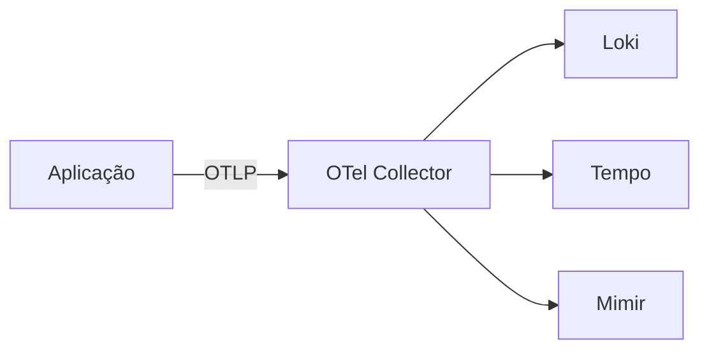

# Fixture com Mermaid e imagem local

Doc de teste pra validar render de Mermaid em PDF + resolver de imagem local em data URI.

---

## Sumário

- [Visão geral](#visão-geral)
- [Quick Start — minimal](#quick-start--minimal)
- [Validação ponta a ponta](#validação-ponta-a-ponta)
- [Troubleshooting](#troubleshooting)

---

## Visão geral

Este fixture testa duas features novas do v0.3.0:

1. **Mermaid render** — bloco `mermaid` é convertido em SVG durante o render PDF.
2. **Image resolver** — paths relativos viram data URI.

### Diagrama de arquitetura



### Asset local


---

## Quick Start — minimal

```bash
echo "fixture"
```

---

## Validação ponta a ponta

```bash
test
```

---

## Troubleshooting

### Mermaid não renderiza

**Causa.** Sem internet no momento do render — CDN do mermaid não carrega.

**Fix.** Rodar com internet, ou substituir bloco mermaid por imagem PNG pre-renderizada.
